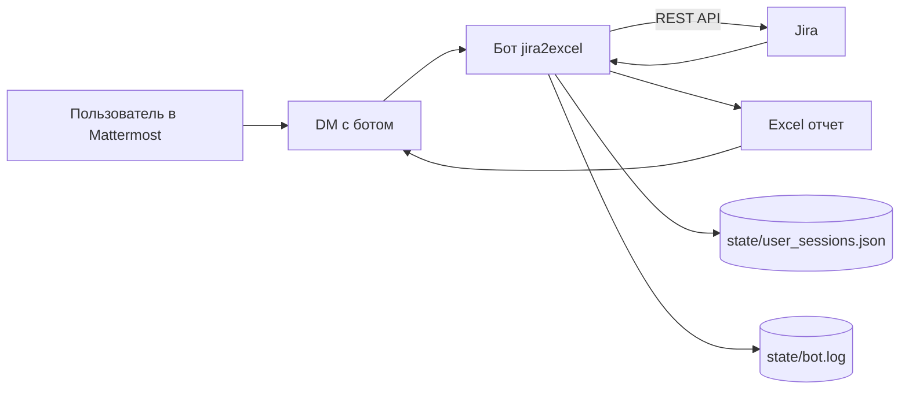
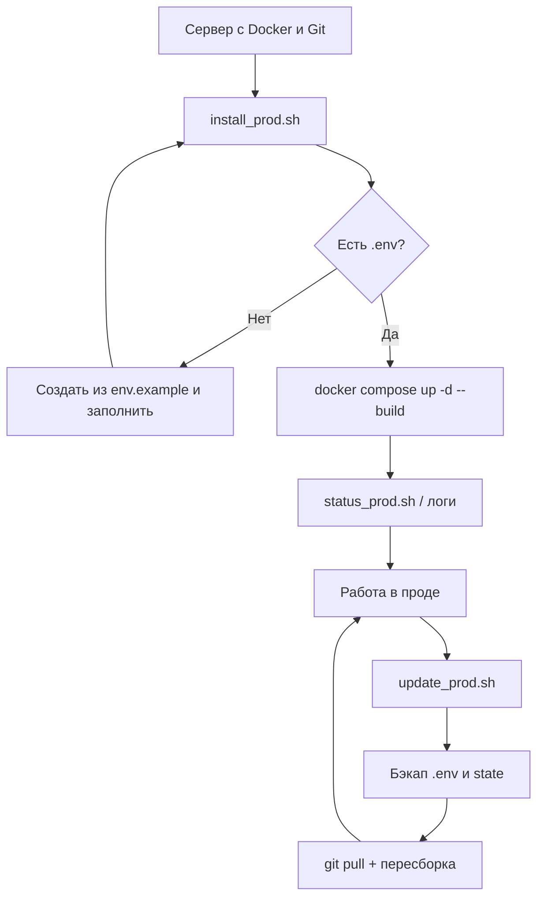
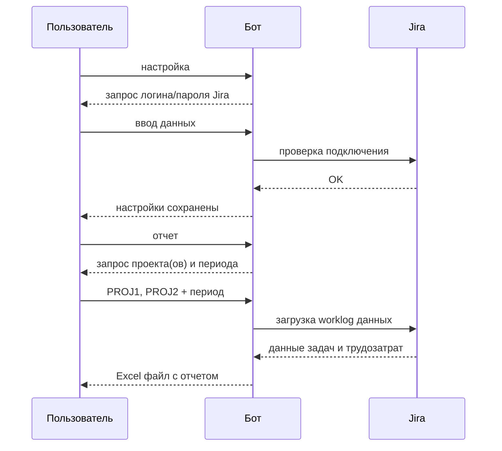

# Бот для выгрузки трудозатрат из Jira в Mattermost

Бот для Mattermost, который интегрируется с корпоративной Jira для выгрузки трудозатрат в Excel формате.

## Функциональность

- 🔐 **Индивидуальная аутентификация** - каждый пользователь под своим аккаунтом Jira
- 📊 Выгрузка трудозатрат из Jira в Excel с корректным форматированием
- 🔍 Фильтрация по одному или нескольким проектам и периоду времени
- 📋 Автоматическое форматирование отчета в требуемом формате КСУП
- 💬 Интерактивное взаимодействие через прямые сообщения в Mattermost
- 📁 Отправка готовых Excel файлов прямо в чат
- 🔄 Сохранение состояния пользователей между перезапусками бота
- 📈 Сводные отчеты по нескольким проектам с детальной статистикой
- 🔒 Шифрование учетных данных пользователей
- 📝 Расширенное описание работ с темой задачи и отдельным столбцом для Jira
- 📅 Корректное отображение дат в российском формате как текст

## Архитектура бота



## Формат отчета

Бот генерирует Excel файлы со следующими столбцами:
- **Дата работы**: в формате DD.MM.YYYY HH:MM:SS (отображается как текст)
- **Исполнитель**: первая часть email до символа @
- **Часы**: количество часов с запятой в качестве разделителя
- **Содержание работы**: в формате "PROJ-123 - Тема задачи: описание работы"
- **Проектная задача**: "Сопровождение [Месяц]"
- **Проект**: название проекта
- **Задача в Jira**: тема (summary) задачи из Jira

## Установка

### 1. Клонирование репозитория

```bash
git clone <repository_url>
cd mm_bot_jira
```

### 2. Установка зависимостей

```bash
pip install -r requirements.txt
```

### 3. Настройка переменных окружения

Скопируйте файл `env.example` в `.env` и заполните необходимые параметры:

```bash
cp env.example .env
```

Отредактируйте `.env`:

```env
# Mattermost настройки
MATTERMOST_URL=https://your-mattermost-instance.com
MATTERMOST_TOKEN=your_bot_token_here
MATTERMOST_TEAM_ID=your_team_id

# Jira настройки (только URL, учетные данные индивидуальные)
JIRA_URL=https://your-company.atlassian.net

# Настройки бота
BOT_NAME=jira-timesheet-bot
LOG_LEVEL=INFO
```

### 4. Создание бота в Mattermost

1. Войдите в Mattermost как администратор
2. Перейдите в **System Console** → **Integrations** → **Bot Accounts**
3. Нажмите **Add Bot Account**
4. Заполните поля:
   - **Username**: `jira-timesheet-bot`
   - **Display Name**: `Jira Timesheet Bot`
   - **Description**: `Бот для выгрузки трудозатрат из Jira`
5. Скопируйте сгенерированный токен в переменную `MATTERMOST_TOKEN`

### 5. Настройка Jira API

1. Войдите в Jira
2. Перейдите в **Account Settings** → **Security** → **API tokens**
3. Создайте новый API токен
4. Скопируйте токен в переменную `JIRA_API_TOKEN`

## Запуск

```bash
python main.py
```

Или в фоновом режиме:

```bash
nohup python main.py > bot.log 2>&1 &
```

## Продакшн в Docker (установка и обновление из Git)

Добавлены скрипты для развертывания на сервере через Docker Compose:

- `scripts/install_prod.sh` — первичная установка (клонирование репозитория + первый запуск)
- `scripts/update_prod.sh` — обновление (получение изменений из Git + пересборка и перезапуск)
- `scripts/status_prod.sh` — проверка статуса контейнера, логов и версии кода

### Схема прод-цикла (Docker)



### Требования на сервере

- `git`
- `docker`
- `docker compose` (или `docker-compose`)

### Пошаговая установка бота в проде (Docker)

1) Подключитесь к серверу и перейдите в директорию, где будет запуск:

```bash
ssh <user>@<server>
cd /opt
```

2) Склонируйте репозиторий и выполните первичную установку:

```bash
git clone https://github.com/chastnik/mm_bot_jira2excel jira2excel
cd jira2excel
./scripts/install_prod.sh /opt/jira2excel main
```

3) Если `.env` еще не заполнен, скрипт создаст его из `env.example` и завершится. Заполните `.env`, затем запустите установку повторно:

```bash
cd /opt/jira2excel
nano .env
./scripts/install_prod.sh /opt/jira2excel main
```

4) Проверьте, что контейнер запущен и бот пишет логи:

```bash
./scripts/status_prod.sh /opt/jira2excel
docker compose -f docker-compose.prod.yml logs -f --tail=100
```

5) Для последующих обновлений используйте:

```bash
./scripts/update_prod.sh /opt/jira2excel main
```

### Первичная установка

```bash
./scripts/install_prod.sh [repo_url] [install_dir] [branch]
```

Пример:

```bash
./scripts/install_prod.sh /opt/jira2excel main
# или явно указать URL:
./scripts/install_prod.sh https://github.com/chastnik/mm_bot_jira2excel /opt/jira2excel main
```

Что делает скрипт:
1. Клонирует репозиторий в `install_dir` (по умолчанию `/opt/jira2excel`)
2. Если нет `.env`, создает его из `env.example` и просит заполнить
3. Запускает контейнер: `docker compose -f docker-compose.prod.yml up -d --build`

### Обновление на проде

```bash
./scripts/update_prod.sh [install_dir] [branch]
```

Пример:

```bash
./scripts/update_prod.sh /opt/jira2excel main
```

Что делает скрипт:
1. Создает бэкап `.env` и `state/user_sessions.json` в `backups/`
2. Выполняет `git fetch`/`git pull --ff-only`
3. Пересобирает и перезапускает контейнер

### Проверка статуса на проде

```bash
./scripts/status_prod.sh [install_dir]
```

Пример:

```bash
./scripts/status_prod.sh /opt/jira2excel
```

### Хранение состояния

В `docker-compose.prod.yml` подключен volume `./state:/app/state`, а entrypoint контейнера
сохраняет:

- `bot.log` в `state/bot.log`
- `user_sessions.json` в `state/user_sessions.json`

## Использование

### Команды бота

- `настройка` - подключение к вашему аккаунту Jira (первый запуск)
- `помощь` или `help` - показать справку (включает ссылку на инструкцию по загрузке в КСУП)
- `проекты` - показать список доступных проектов Jira
- `отчет` или `трудозатраты` - начать процесс генерации отчета
- `сброс` - очистить сохраненные данные авторизации

### Процесс генерации отчета

⚠️ **Важно: Бот работает только в прямых сообщениях!**



#### Первое использование:
1. Откройте прямые сообщения с ботом в Mattermost
2. Напишите боту команду `настройка`
3. Введите ваше имя пользователя для подключения к Jira
4. Введите ваш пароль для Jira
5. Бот проверит подключение и сохранит данные в зашифрованном виде

#### Генерация отчета:
1. Напишите боту команду `отчет`
2. Укажите ключ проекта или несколько ключей через запятую:
   - **Один проект:** `PROJ`
   - **Несколько проектов:** `PROJ1, PROJ2, PROJ3`
3. Укажите период для отчета в свободном формате или стандартном
4. Получите Excel файл с трудозатратами

### 📅 Форматы указания периода

Бот поддерживает указание периода в удобном свободном формате на русском языке:

**Относительные периоды:**
- `сегодня`, `вчера`, `позавчера`
- `прошлая неделя`, `эта неделя`
- `прошлый квартал`, `этот квартал`
- `2 квартал 2024`, `первый квартал`, `II квартал` 
- `прошлый месяц`, `этот месяц`
- `прошлый год`, `этот год`

**Месяцы:**
- `май` - текущий май
- `июнь 2024` - конкретный месяц года
- `с мая по июнь` - период между месяцами
- `с мая по июнь 2024` - с указанием года

**Конкретные даты:**
- `с 15 мая по 20 июня` - точные числа
- `с 1 января 2024 по 31 декабря 2024`

**Последние периоды:**
- `последние 7 дней`
- `последние 2 недели` 
- `последние 3 месяца`

**Стандартный формат:**
- `2024-01-01` - один день
- `с 2024-01-01 по 2024-01-31` - точный период

**Возможности при работе с несколькими проектами:**
- Создается сводный отчет со всеми данными в одной таблице
- Данные автоматически сортируются по дате
- В отчете отображается статистика по каждому проекту отдельно
- Поддерживается неограниченное количество проектов

Если процесс генерации отчета прервался (например, при перезапуске бота), просто напишите любое сообщение боту, и он продолжит с того места, где остановился.

### Примеры использования

**Отчет по одному проекту:**
```
Пользователь: отчет
Бот: Введите ключ проекта или несколько ключей через запятую:
     • Один проект: PROJ
     • Несколько проектов: PROJ1, PROJ2, PROJ3
     • Введите `проекты` для просмотра списка доступных проектов

Пользователь: MYPROJ
Бот: ✅ Выбрано My Project (MYPROJ)
     📅 Укажите период для отчета:
     
     Примеры периодов:
     • прошлая неделя или эта неделя
• прошлый квартал или этот квартал
• 2 квартал 2024 или первый квартал
     • прошлый месяц или этот месяц
     • май или июнь 2024
     • с мая по июнь
     • с 15 мая по 20 июня
     • последние 7 дней
     • последние 2 недели
     • 2024-01-01 (один день)
     • с 2024-01-01 по 2024-01-31

Пользователь: прошлый месяц
Бот: ✅ Прошлый месяц: с 2024-05-01 по 2024-05-31
     ⏳ Генерирую отчет... Это может занять некоторое время.
     📊 Отчет по трудозатратам готов!
     [Excel файл прикреплен к сообщению]
```

**Сводный отчет по нескольким проектам:**
```
Пользователь: отчет
Бот: Введите ключ проекта или несколько ключей через запятую:...

Пользователь: PROJ1, PROJ2, PROJ3
Бот: ✅ Выбрано 3 проектов:
     • Project One (PROJ1)
     • Project Two (PROJ2) 
     • Project Three (PROJ3)
     📅 Укажите период для отчета:
     [примеры периодов...]

Пользователь: с 1 января по 31 января 2024
Бот: ✅ Период: с 1 января 2024 по 31 января 2024
Бот: ⏳ Генерирую отчет... Это может занять некоторое время.
     📊 Отчет по трудозатратам готов!
     
     Проекты: Project One, Project Two, Project Three
     Период: с 2024-01-01 по 2024-01-31
     Всего записей: 45
     Общее время: 87.5 ч
     
     Статистика по проектам:
     • Project One (PROJ1): 15 записей, 28.5 ч
     • Project Two (PROJ2): 20 записей, 35.0 ч
     • Project Three (PROJ3): 10 записей, 24.0 ч
     
     [Excel файл прикреплен к сообщению]
```

## Структура проекта

```
mm_bot_jira/
├── main.py              # Точка входа
├── config.py            # Конфигурация
├── mattermost_bot.py    # Основная логика бота
├── jira_client.py       # Клиент для работы с Jira API
├── excel_generator.py   # Генератор Excel отчетов
├── date_parser.py       # Парсер дат в свободном формате
├── user_auth.py         # Управление аутентификацией пользователей
├── requirements.txt     # Зависимости Python
├── env.example          # Пример переменных окружения
├── start_bot.sh         # Скрипт запуска бота
├── SETUP.md            # Инструкции по настройке
├── INSTALL_SERVICE.md   # Инструкции по установке как сервис
├── .gitignore          # Исключения для Git
└── README.md           # Документация
```

## Последние обновления

### Версия 2.1 (Июнь 2025)
- ✅ **Исправлено форматирование Excel файлов**: убрана пустая первая колонка
- ✅ **Улучшено отображение дат**: формат DD.MM.YYYY HH:MM:SS как текст
- ✅ **Расширено описание работ**: добавлена тема задачи в формат "НОМЕР - ТЕМА: описание"
- ✅ **Новый столбец "Задача в Jira"**: отдельный столбец с темой задачи
- ✅ **Добавлена ссылка на инструкцию КСУП** в команду помощи
- ✅ **Исправлены ошибки типизации** для совместимости с современными IDE

### Формат Excel отчета
**Структура столбцов (A-G):**
1. **A**: Дата работы (22.01.2024 00:00:00)
2. **B**: Исполнитель 
3. **C**: Часы (с запятой: 1,5)
4. **D**: Содержание работы (IDB-5704 - Тема задачи: описание)
5. **E**: Проектная задача (Сопровождение Январь)
6. **F**: Проект (название проекта)
7. **G**: Задача в Jira (тема задачи)

## Логирование

Бот ведет логи в двух местах:
- Консоль (stdout)
- Файл `bot.log`

Уровень логирования настраивается через переменную `LOG_LEVEL` в `.env`.

## CI

В проекте настроен GitHub Actions workflow `.github/workflows/ci.yml` с двумя jobs:

- `python-checks`:
  - установка зависимостей из `requirements-dev.txt`
  - `ruff check .`
  - `black --check .`
  - `pytest` (если есть директория `tests/`)
- `docker-build`:
  - проверка сборки Docker-образа командой `docker build -t jira2excel-ci .`

## Устранение неполадок

### Бот не отвечает на сообщения

1. Проверьте подключение к Mattermost:
   ```bash
   curl -i -H "Authorization: Bearer $MATTERMOST_TOKEN" \
   $MATTERMOST_URL/api/v4/users/me
   ```

2. Пишите боту только в личные сообщения (бот не работает в каналах)

### Ошибки подключения к Jira

1. Проверьте URL Jira и учетные данные
2. Убедитесь, что API токен действителен
3. Проверьте права доступа к проектам

### Пустые отчеты

1. Убедитесь, что в указанном периоде есть worklog записи
2. Проверьте права доступа к проекту в Jira
3. Убедитесь, что даты указаны в правильном формате

## Дополнительные функции

### Сохранение состояния между перезапусками

Бот автоматически сохраняет состояние пользователей в файл `user_sessions.json`. Это означает:
- Если пользователь был в процессе создания отчета и бот перезапустился, процесс продолжится с того же места
- Пользователю не нужно начинать заново - достаточно написать любое сообщение боту
- Состояние сохраняется при каждом шаге взаимодействия

### Работа только в прямых сообщениях

- Бот **не отвечает** в каналах или группах
- Для использования бота откройте прямые сообщения с ним
- Это обеспечивает приватность при работе с отчетами

### Автоматическая инициализация новых пользователей

**Как это работает:**
- Когда пользователь впервые пишет боту, Mattermost автоматически создает Direct Message канал
- Бот получает события через WebSocket соединение и автоматически обрабатывает сообщения от новых пользователей
- Дополнительная настройка или регистрация пользователей **не требуется**

**Механизм обработки новых пользователей:**
1. Пользователь открывает прямые сообщения с ботом
2. Пишет любое сообщение
3. Mattermost создает DM канал автоматически
4. Бот мгновенно начинает получать и обрабатывать сообщения
5. Новая сессия создается при необходимости

**Мониторинг и логирование:**
- Бот логирует создание новых DM каналов
- Отслеживает добавление пользователей
- Проверяет доступность каналов при запуске

## Безопасность

- Храните `.env` файл в безопасности
- Не коммитьте токены в Git
- Используйте отдельного пользователя Jira для бота
- Ограничьте права доступа бота только необходимыми проектами
- Файл `user_sessions.json` содержит персональные данные и исключен из Git

## Поддержка

При возникновении проблем:
1. Проверьте логи в файле `bot.log`
2. Убедитесь в правильности настроек в `.env`
3. Проверьте подключение к Mattermost и Jira 

(с) Стас Чашин